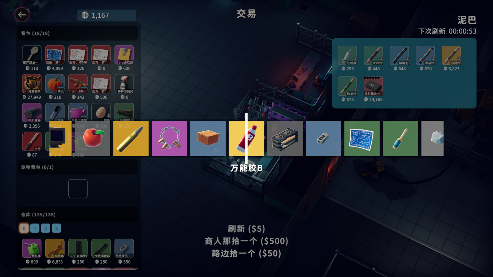

# Lucky "Box"

[中文](README.md) | **English**

A mod for "Escape from Duckov" that allows players to use additional features in the shop.

## Features

1. ⌚ A decent-looking lottery animation

2. ♻️ "Refresh": Refresh the current merchant's inventory

3. 👌 "Pick One from Merchant": Randomly draw one item from the current merchant's inventory (reduces stock)

4. 😊 "Pick One from Roadside": Randomly draw one item from all possible items in the game (doesn't affect the stock)

5. ⚙️ Press F1 to open the settings panel to enable/disable animations and customize the cost of the above three features (default values: 5, 50, 50) (both account balance and cash can be used for payment)

⚠️ Warning: "Pick One from Roadside" may draw illegal items that are not available in the game (although "most" have been filtered out). Please use it carefully❗ Especially for recipes that "look very abnormal"❗ This may corrupt your save file. Please backup your save before using❗

⚠️ Note: Current settings configuration does not support persistence. Settings will be restored to default values after mod restart❗

## Future Plans

1. 📦 Add "Lucky Box" item that randomly draws an item or BUFF when opened
2. ⚙️ Settings persistence

## Links

Source Code: https://github.com/DarkHighness/DuckovLuckyBox

Steam Workshop: https://steamcommunity.com/sharedfiles/filedetails/?id=3589741459