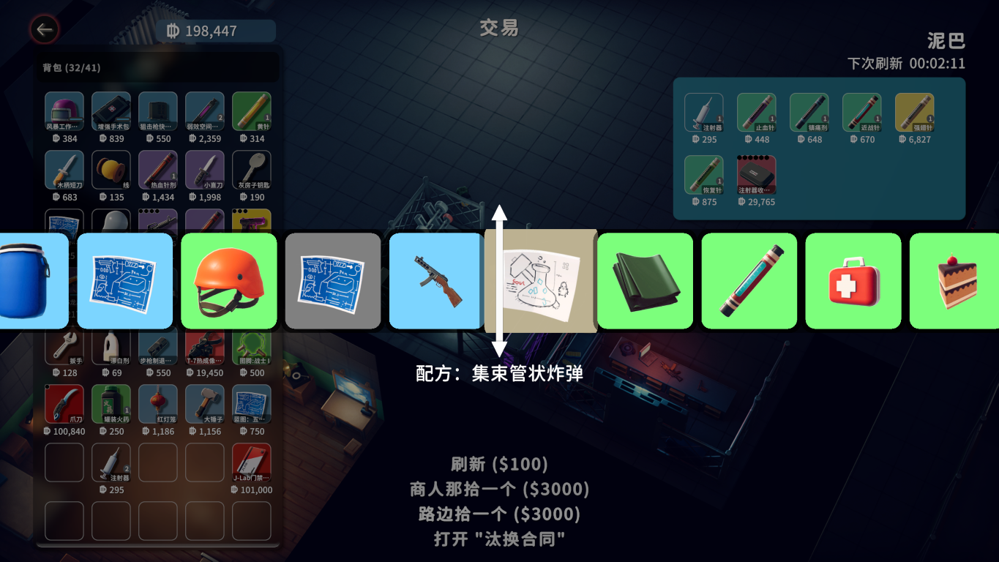

# 幸运"方块"

**中文** | [English](README.EN.md)

这是一个 "逃离鸭科夫" 的 Mod，允许玩家在商店中使用额外的功能。

## 截图

## 功能

1. ⌚ 一个看起来还行的抽奖动画
2. ♻️ "刷新"：刷新当前商人的库存情况
3. 👌 "商人那拾一个"：从当前商人的库存当中随机抽一件，会扣库存
4. 😊 "路边拾一个"：从游戏所有可能的物品当中随机抽一件，不涉及库存
5. ⚙️ 按 F1 可打开设置面板，开启或关闭动画，自定义上述三项功能的花费（默认值： 5, 50, 50）（账户和现金均可支付花费）

⚠️ 警告："路边拾一个" 有可能抽到游戏内未开放的非法物品（尽管已经尽力过滤了 "绝大部分"），请仔细斟酌使用❗特别是对于 "看起来就很异常的" 配方❗可能会导致存档损坏，使用前请务必备份存档❗

## 灵感来源

Minecraft "幸运方块"

## 未来计划

1. 📦 添加"幸运方块"道具，当打开时，随机抽取一件物品或BUFF
2. ~~设置配置落盘~~ ✅ **已完成！**

## 配置

设置会自动保存到 `{Application.persistentDataPath}/Duckov.LuckyBox/config.json`。

配置文件支持：
- **EnableAnimation**: 启用/关闭抽奖动画（默认：`true`）
- **SettingsHotkey**: 打开设置面板的快捷键（默认：`"F1"`）
- **RefreshStockPrice**: 刷新商人库存的花费（默认：`5`）
- **StorePickPrice**: 从商人库存抽奖的花费（默认：`50`）
- **StreetPickPrice**: 从所有物品抽奖的花费（默认：`50`）

当配置文件被外部修改时，Mod 会自动重新加载设置。

配置文件示例请参见 [config.example.json](config.example.json)。

## 相关链接

源代码仓库: https://github.com/DarkHighness/DuckovLuckyBox

Steam 创意工坊: https://steamcommunity.com/sharedfiles/filedetails/?id=3589741459
